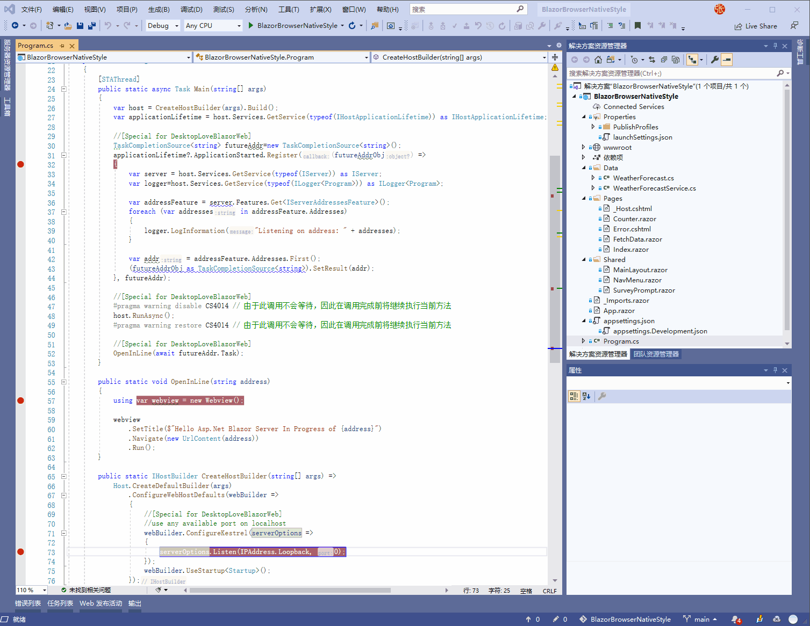
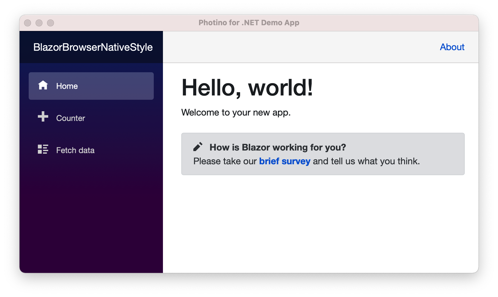

# What this Project try to do

Find a solution to mix the best part of .net for desktop application

1. Work with dotnet and get all the benefits of its improvement like

    1. The best c# language
    2. The great Dotnet Framework Library
    3. SingleFile Deploy mode
    4. Cross platform

2. Use asp.net's modern UI technology like Blazor to release the productivity for frontend development
3. Easily cross-platform, support Windows/Linux/Mac OSX seamlessly
4. Follow upstream of [photino.NET](https://github.com/tryphotino/photino.NET)
5. Focus on Latest Blazor&Dotnet version

# Background

My teams are all C# boys, we want to use web technology and migration some old style internal desktop application which develop by MFC/WINFORM/WPF, we can not simple use webassembly and PWA, as these software is really desktop style, and pack and run on customer computer, we can not deliver it by webserver/CDN and so on.

# The struct of the application

1. asp.net run in the process
2. in process browser to show the server content
    1. [Photino/WebWindows][prefer] (use https://github.com/tryphotino/photino.NET)
    2. [webview] (use https://github.com/webview/webview_csharp)

# A Demo

# Why

Because Microsft create much great technology, but this giant is also always a work in progress, As the developer, we can just choose the most solid and stable part, that's it.

As Microsoft will never stop its step for some corner requirement, this just cares about the big future, that's why many developers hate it or like it, and for us, we just choose the best part of it so solve the current problem first.

So, dotnet+cross platform browser+great blazor technology.

## Some word to friends who use old UI technology on Microsoft stack

From Win32/MFC/WinForm/WPF/...to Blazor, I think Blazor is value to try, as this new style base on virtual dom/increment dom like idea is really change the UI coding style and greatly improve the productively, one month's work can be done in on week now, that's really great

# Reference
1. hope MobileBlazorBindings support fixed version deploy mode https://github.com/xamarin/MobileBlazorBindings/pull/202
2. hope webview/webview_csharp can support webview2 fixed version deploy mode https://github.com/webview/webview_csharp/issues/4 https://github.com/webview/webview/issues/493
3. some talk from v2ex.com https://s.v2ex.com/t/720460
4. maybe solve the problem of https://github.com/webview/webview_csharp/issues/4
5. a very promise blazor UI libray https://github.com/ant-design-blazor/ant-design-blazor
6. chromium base edge will be part of windows https://techcommunity.microsoft.com/t5/microsoft-365-blog/new-microsoft-edge-to-replace-microsoft-edge-legacy-with-april-s/ba-p/2114224
7. reddit talk https://www.reddit.com/r/Blazor/comments/lw9prg/will_you_use_net_blazor_for_desktop_application/
8. awesome balzor https://github.com/AdrienTorris/awesome-blazor
9. awesome dotnet core https://github.com/thangchung/awesome-dotnet-core
